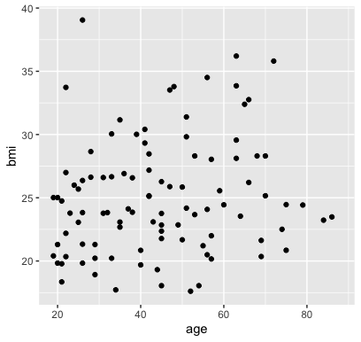
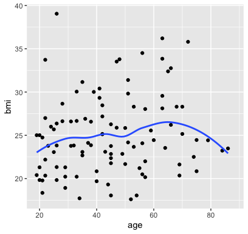
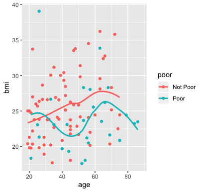
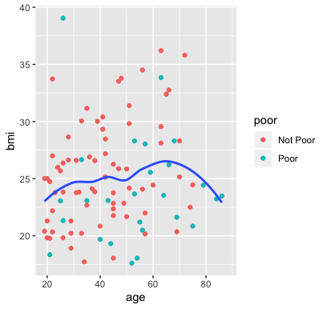
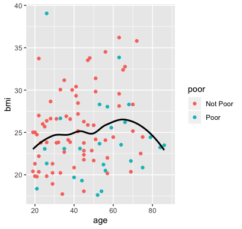
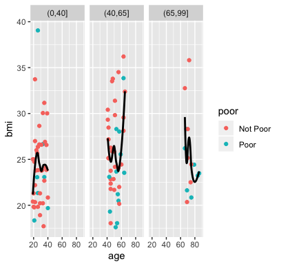
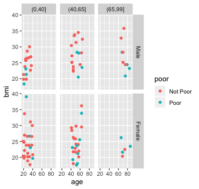
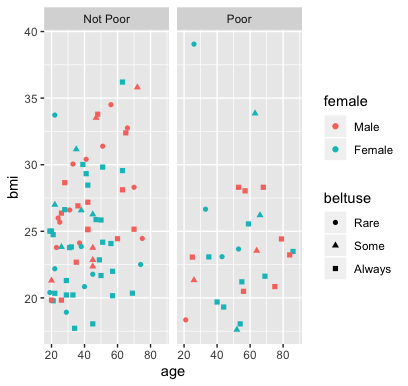
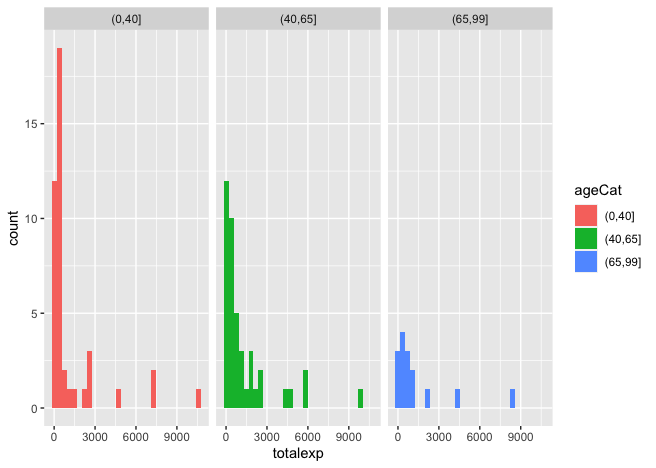

```{r setup, include=FALSE}
knitr::opts_chunk$set(echo = TRUE)
```

**Due at the end of class on Monday, September 13 through Github**

Your next assignment is to recreate nine plots with the `ggplot` using the subset of `nmes.data` we worked with in class.

**Work through the following items:**

(1) Knit this document.  Then edit the YAML header of this `.Rmd` file to include your name and today's date.  Knit the document again and be sure your changes are reflected in the updated output!

(2) Load the `tidyverse` so you can work with `ggplot`:
```{r}
library(tidyverse)
```

(3) Load the `nmes.data` object stored in the `nmesSub.rda` file:
```{r}
load("nmesSub.rda")
```

(4) For each of A through H below, write code inside the code chunk to reproduce the plot.

A.  
```{r}

```

B.  
```{r}

```

C.  
```{r}

```

D.  
```{r}

```

E.  
```{r}

```

F.  
```{r}

```


G.  
```{r}

```

H.  
```{r}

```

I. For this one, you may want to check out the [Data Visualization Cheatsheet](https://www.rstudio.com/resources/cheatsheets/#ggplot2){target="_blank"} to look at different geom options.

 
```{r}

```

5. Now knit the file again and be sure it generates a new document with all of your reproduced plots.

6. If your document successfully knit without error, you are ready to submit your assignment through Github.  To do so, follow the steps below.  (If your document didn't successfully knit, please reach out to me over email at `phbiostats@jhu.edu` so I can help you trouble-shoot the issue.)

* First you need to **commit** the changes you've made to the document.  Click the colorful Git button at the top of the RStudio window and select "Commit" from the menu.
* In the window that opens, **stage** your changes by clicking the check boxes next to the `Mini1-1.Rmd` file.
* In the "Commit message" box, type a short description of what changes you've made, something like: `Completed assignment`
* Click the "Commit" button on the bottom right.
* You'll see a window that will tell you about the changes that you've made.  Click "Close" to close the window.  You've successfully committed! You can close this commit window now.
* After committing, you must **push** your changes to the repository on Github.  Do this by clicking the colorful Git button again and select "Push Branch".  
* Again, you'll see a window open that tells you your changes have been pushed!
* If you want, you can look at your repository on [Github.com](https://github.com/) and should be able to see your changes there!  
* You've successfully submitted your assignment :)


